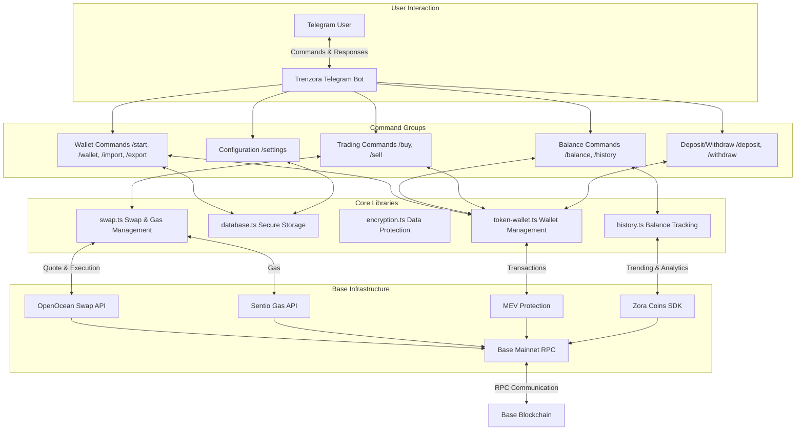

# Trenzora Telegram Trading Bot

A secure, user-friendly Telegram bot for trading Zora tokens on Base Mainnet, built for the Zora Coinathon 2024. Trenzora leverages real-time intelligence, MEV protection, and seamless wallet management to empower users to discover and trade trending Zora coins directly from Telegram.


## Features

- 🔐 **Secure Wallet Management**:
  - Create new wallets directly from Telegram
  - Import existing wallets using private keys
  - Encrypted storage of private keys
  - Export option with security confirmations

- 💰 **Balance & History**:
  - Display ETH and Zora token balances
  - Track balance history with tables
  - View monthly, weekly, or daily history

- 💱 **Trading Functionality**:
  - Buy Zora tokens with ETH
  - Sell Zora tokens for ETH
  - MEV-protected transactions
  - Gas cost estimates and optimization

- 📤 **Transfer Features**:
  - Deposit ETH to your wallet
  - Withdraw ETH to any address

- ⚙️ **Customizable Settings**:
  - Adjustable slippage tolerance
  - Gas priority selection (low/medium/high)

## Technology Stack

- **Language**: TypeScript
- **Bot Framework**: [grammY](https://grammy.dev/)
- **EVM Toolkit**: [viem](https://viem.sh/)
- **Database**: SQLite via better-sqlite3
- **Integrations**:
  - Zora Coins SDK for trending tokens and analytics
  - OpenOcean API for swaps
  - Sentio Gas Price API for gas estimates
  - MEV Protection for secure trading

## Architecture



## Database

This bot uses a local **SQLite database** (powered by `better-sqlite3`) to securely manage user sessions, wallets, trading settings, and transaction history.

#### Here's what gets stored:

| Table        | Purpose                                                                 |
|--------------|-------------------------------------------------------------------------|
| `users`      | Maps Telegram users to unique user IDs, stores basic metadata          |
| `wallets`    | Stores each user’s encrypted private key and wallet address            |
| `settings`   | Persists user-defined trading preferences (slippage, gas priority, etc.) |
| `transactions` | Records details of swap activity, including from/to tokens, gas used, and status |

All wallet private keys are **encrypted using AES-256-CBC** and decrypted only in memory during bot operations. This ensures strong security while allowing persistent wallet access across sessions.

The database is initialized automatically on first run (`src/lib/database.ts`), so no setup is needed beyond ensuring you have a valid `WALLET_ENCRYPTION_KEY` in your `.env`.

## Getting Started

### Prerequisites

- Node.js 20.x or higher
- Base Mainnet RPC Endpoint URL
- Telegram Bot token (get from @BotFather)

### Installation

1. Clone the repository

```bash
git clone https://github.com/MakindeAhmed2110/trenzora.git
cd trenzora/telegram-trading-bot
```

2. Install dependencies:

```bash
npm install
```

3. Create a `.env` file based on the example:

```bash
cp .env.example .env
```

4. Get a Telegram Bot Token

    - Open Telegram and search for the BotFather (@BotFather)
    - Send the command `/newbot`
    - Follow the instructions to name your bot
    - Keep the token provided by BotFather handy

5. Get a Base Mainnet RPC Endpoint URL

    - Use a provider like QuickNode, Alchemy, or Infura
    - Create a Base Mainnet endpoint
    - Keep the endpoint URL handy

6. Create a wallet encryption key to encrypt your private keys

```bash
openssl rand -base64 32
```

> **Important**: This key is used to encrypt and decrypt users' private keys. Without it, or if it's lost, it's impossible to decrypt stored wallets. Store it securely and never share it with anyone.

7. Fill in your environment variables in the `.env` file:

```env
TELEGRAM_BOT_TOKEN=your_telegram_bot_token
QUICKNODE_RPC=your_base_mainnet_endpoint
WALLET_ENCRYPTION_KEY=random_32_char_string
DB_PATH=path_to_sqlite_db (default: ./database.sqlite)
CHAIN_ID=base_mainnet_chain_id (default: 8453)
DEFAULT_SLIPPAGE=default_slippage_tolerance (default: 1)
DEFAULT_GAS_PRIORITY=default_gas_priority (default: medium)
```

### Running the Bot

For development:
```bash
npm run dev
```

For production:
```bash
npm run start
```

## Usage

After creating your bot with [@BotFather](https://t.me/BotFather), **open Telegram and send a message to your bot by searching for the bot username you just created** (e.g., `@trenzorabot`).

### Basic Commands

- `/start` - Initialize the bot and register
- `/help` - Show all available commands
- `/wallet` - Display wallet information
- `/balance` - Show token balances
- `/history` - Display balance history

### Wallet Management

- `/create` - Create a new wallet
- `/import` - Import an existing wallet via private key
- `/export` - Export your private key (with security confirmation)

### Trading

- `/buy` - Buy Zora tokens with ETH
- `/sell` - Sell Zora tokens for ETH
- `/settings` - Configure trading parameters

### Transfers

- `/deposit` - Show your wallet address for deposits
- `/withdraw` - Withdraw ETH to another address

## Security Considerations

- Private keys are encrypted using AES-256 before storage
- Sensitive operations require confirmation
- All transactions use MEV protection to prevent front-running

## Disclaimer

This software is provided for educational and demonstration purposes only. Use at your own risk. Always verify transactions and conduct proper security reviews before using in production environments.

### Troubleshooting Common Issues

If you encounter the following error when starting the bot:
```bash
Error: Could not locate the bindings file.
```

This indicates that `better-sqlite3` native bindings failed to build correctly, often due to mismatched Node.js versions or incomplete dependency compilation.

#### Recommended Fix: Manual Rebuild
Rebuild the native bindings from source:

```bash
cd node_modules/better-sqlite3
npm run build-release
ls build  # Verify that a .node file (e.g., better_sqlite3.node) appears
cd ../..
```

This command compiles the bindings for your system’s Node.js version, resolving the error.

#### Alternative Fixes:

**Clean and Reinstall Dependencies:** If the rebuild fails, clear the `node_modules` directory and reinstall:

```bash
rm -rf node_modules package-lock.json
npm install
```

**Check Node.js Version**: Ensure you’re using Node.js 20.x or higher, as better-sqlite3 may not support older versions.
